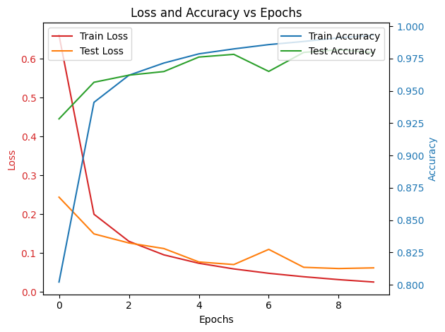
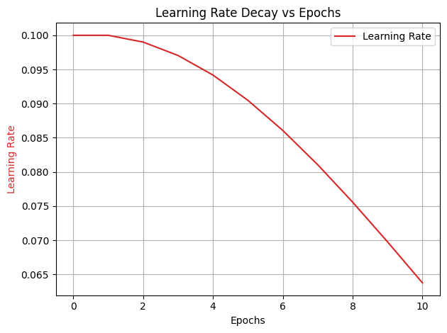
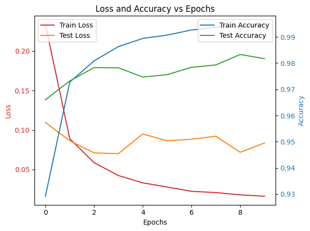
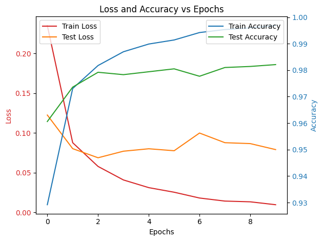
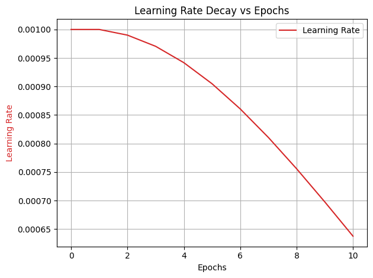
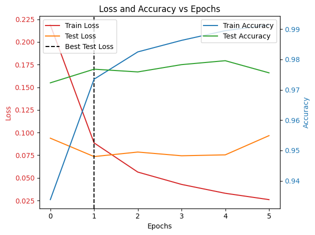
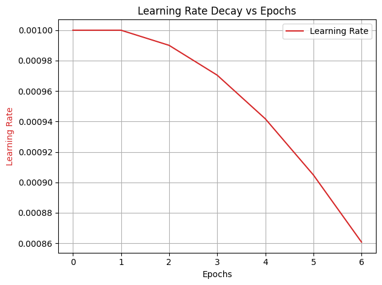

# Deep Neural Network

A fully connected neural network (MLP) implemented from scratch in Python. The only library used in the making of this neural net is **NumPy**.

I trained this model over the MNIST dataset with:

- Testing Accuracy: 98.5%
- Training Accuracy: 99.4%

and over the Fashion MNIST dataset with:

- Testing Accuracy: 89.4%
- Training Accuracy: 95.3%

## Architecture

- Input layer with 784 neurons
- 2 Hidden layers with 800 neurons each
- Output layer with 10 neurons

The neural network uses ReLU activation for hidden layers and Softmax for the output layer to produce a probability distribution for classification.

The code is not dependent on a predefined architecture.

## Initialization

The weights are initialized with random values drawn from a normal distribution `np.random.randn`. This ensures that the weights start with small random values, preventing symmetry. The weights are scaled by `0.01` to ensure they are small. This avoids exploding gradients in the early stages of training. The biases are initialized to zero `np.zeros`.

The network is constructed layer-by-layer, connecting each layer to the previous one through the weights and biases. For each hidden layer, we create a weight matrix and bias vector.

```python
def __init__(self, input_nodes=784, hidden_layers=[800, 800], output_nodes=10, activation='relu', learning_rate=0.001):

    if activation == 'relu':
        self.activation = self.ReLU
    elif activation == 'sigmoid':
        self.activation = self.sigmoid

    self.input_nodes = input_nodes
    self.hidden_layers = hidden_layers
    self.output_nodes = output_nodes
    self.initial_lr = learning_rate

    self.weights = []
    self.biases = []

    # input layer to first hidden layer
    w = 0.01 * np.random.randn(self.input_nodes, self.hidden_layers[0])
    b = np.zeros((1, self.hidden_layers[0]))
    self.weights.append(w)
    self.biases.append(b)

    # between all hidden layers
    for i in range(1, len(hidden_layers)):
        w = 0.01 * np.random.randn(self.hidden_layers[i-1], self.hidden_layers[i])
        b = np.zeros((1, self.hidden_layers[i]))
        self.weights.append(w)
        self.biases.append(b)

    # last hidden layer to output layer
    w = 0.01 * np.random.randn(self.hidden_layers[-1], self.output_nodes)
    b = np.zeros((1, self.output_nodes))
    self.weights.append(w)
    self.biases.append(b)

    return
```

## Feed Forward

Each layer computes a linear transformation followed by an activation function, except the output layer where we apply softmax for classification tasks. The input vector `a` is passed through the first hidden layer. The operation `np.matmul(a, self.weights[i]) + self.biases[i]` computes a weighted sum of the inputs, which is then passed through the activation function `self.activation(z)`. For the output layer, the weighted sum is computed just as for the hidden layers and we apply the Softmax function to transforms the output into a probability distribution over the classes, which is useful for classification problems like the MNIST dataset.

```python
def feed_forward(self, inputs):

    self.outputs_activation = []
    self.outputs_linear = []

    a = inputs
    self.outputs_activation.append(a)

    # All layers other than the output layer have their activation function
    for i in range (len(self.hidden_layers)):
        z = np.matmul(a, self.weights[i]) + self.biases[i]
        self.outputs_linear.append(z)
        a = self.activation(z)
        self.outputs_activation.append(a)

    # The last layer has a softmax function
    z = np.matmul(a, self.weights[-1]) + self.biases[-1]
    self.outputs_linear.append(z)
    a = self.softmax(z)
    self.outputs_activation.append(a)

    return self.outputs_activation[-1]
```

## Back Propagation

Backpropagation allows the model to adjust its parameters based on the error in its predictions. This function computes the gradients of the loss function with respect to each weight and bias using the chain rule. The difference between the predicted output `y_hat` and the true labels `y` is used to calculate the gradient of the loss function with respect to the output layer's inputs `dZ`. The gradient with respect to the weights `dW` is computed as the product of the activations from the previous layer `self.outputs_activation[-2].T` and `dZ`. The bias gradient `db` is the average of the `dZ` values across the batch `np.sum(dZ, axis=0, keepdims=True)`. For each hidden layer, the error is propagated backward to compute the gradients with respect to the weights and biases. This is done by calculating `dA = np.matmul(dZ, self.weights[i+1].T)` which gives the gradient with respect to the previous layer's output. The derivative of the activation function is used to compute `dZ` (which adjusts for the non-linearity). After calculating the gradients for each layer, the order of gradients is reversed since backpropagation computes gradients starting from the output layer and moving backward to the input layer.

```python
def back_propagation(self, y, y_hat):

    m = y.shape[0]  # batch size

    self.dW = []
    self.db = []

    # for the output layer
    dZ = self.outputs_activation[-1] - y
    dW = (1. / m) * np.matmul(self.outputs_activation[-2].T, dZ)
    db = (1. / m) * np.sum(dZ, axis=0, keepdims=True)

    self.dW.append(dW)
    self.db.append(db)

    # for layers before the output layer
    for i in range(len(self.hidden_layers) - 1, -1, -1):
        dA = np.matmul(dZ, self.weights[i+1].T)
        dZ = dA * self.activation(self.outputs_linear[i], d=True)
        dW = (1. / m) * np.matmul(self.outputs_activation[i].T, dZ)
        db = (1. / m) * np.sum(dZ, axis=0, keepdims=True)
        self.dW.append(dW)
        self.db.append(db)
    
    self.dW.reverse()
    self.db.reverse()

    return self.dW, self.db
```

## Optimization

The classic stochastic gradient descent. The parameters are updated by subtracting the product of the learning rate and the gradient of the loss function with respect to each parameter.

```python
def optimize(self, learning_rate):

    for i in range(len(self.hidden_layers) + 1):
        self.weights[i] -= learning_rate * self.dW[i]
        self.biases[i] -= learning_rate * self.db[i]

    return self.weights, self.biases
```

The Adam optimizer adapts the learning rates for each parameter based on the moving averages of past gradients and squared gradients. The bias correction ensures that the moving averages are unbiased. The hyperparameters are initialized when the network parameters are initialized.

```python
# Adam hyperparameters
self.beta1 = beta1
self.beta2 = beta2
self.epsilon = epsilon

self.m_w = [np.zeros_like(w) for w in self.weights]
self.m_b = [np.zeros_like(b) for b in self.biases]
self.v_w = [np.zeros_like(w) for w in self.weights]
self.v_b = [np.zeros_like(b) for b in self.biases]
self.t = 0  # time step for Adam
```

The algorithm maintains moving averages of both the gradients `m_w, m_b` and the squared gradients `v_w, v_b`. These averages help smooth out the updates and improve convergence. At the beginning of training, the moving averages are biased toward zero, so bias correction is applied `m_w_hat, m_b_hat, v_w_hat, v_b_hat`. The weights and biases are updated using the moving averages, scaled by a corrected learning rate `np.sqrt(v_w_hat) + self.epsilon`, where epsilon prevents division by zero.

```python
def optimize(self, learning_rate):

    if learning_rate is None:
        learning_rate = self.initial_lr     # default learning rate

    self.t += 1     # increment time step

    for i in range(len(self.hidden_layers) + 1):
        # moving averages of the gradients
        self.m_w[i] = self.beta1 * self.m_w[i] + (1 - self.beta1) * self.dW[i]
        self.m_b[i] = self.beta1 * self.m_b[i] + (1 - self.beta1) * self.db[i]

        # moving averages of the squared gradients
        self.v_w[i] = self.beta2 * self.v_w[i] + (1 - self.beta2) * np.square(self.dW[i])
        self.v_b[i] = self.beta2 * self.v_b[i] + (1 - self.beta2) * np.square(self.db[i])

        # bias correction
        m_w_hat = self.m_w[i] / (1 - self.beta1**self.t)
        m_b_hat = self.m_b[i] / (1 - self.beta1**self.t)
        v_w_hat = self.v_w[i] / (1 - self.beta2**self.t)
        v_b_hat = self.v_b[i] / (1 - self.beta2**self.t)

        self.weights[i] -= learning_rate * m_w_hat / (np.sqrt(v_w_hat) + self.epsilon)
        self.biases[i] -= learning_rate * m_b_hat / (np.sqrt(v_b_hat) + self.epsilon)

    return self.weights, self.biases
```

## Training

The data is divided into mini-batches. This makes gradient updates more frequent, which often speeds up training. The training data is shuffled at the start of each epoch to prevent the model from learning patterns based solely on the order of the data. The input batch is passed through the network to obtain predictions. The gradients are computed via backpropagation, and the parameters are updated using the a optimizer.

```python
def train(self, x_train, y_train, x_test, y_test, epochs, batch_size):
    
    learning_rate = self.initial_lr

    for epoch in range(epochs):

        # shuffle data
        indices = np.random.permutation(x_train.shape[0])
        x_train = x_train[indices]
        y_train = y_train[indices]
        num_batches = x_train.shape[0] // batch_size

        for i in range(0, x_train.shape[0], batch_size):
            x = x_train[i:i+batch_size]
            y = y_train[i:i+batch_size]
        
            # forward pass
            y_hat = self.feed_forward(x)

            # back propagation and optimization
            self.back_propagation(y, y_hat)
            self.optimize(learning_rate)

    return self.weights, self.biases
```

## Comparative Study

### Stochastic Gradient Descent

Learning rate = 0.1

```txt
Epoch 1/10 - 30.60s - Train Loss: 0.6609, Test Loss: 0.2441, Train Accuracy: 80.21%, Test Accuracy: 92.83%
Epoch 2/10 - 65.93s - Train Loss: 0.2001, Test Loss: 0.1495, Train Accuracy: 94.11%, Test Accuracy: 95.66%
Epoch 3/10 - 96.51s - Train Loss: 0.1304, Test Loss: 0.1261, Train Accuracy: 96.20%, Test Accuracy: 96.21%
Epoch 4/10 - 127.26s - Train Loss: 0.0955, Test Loss: 0.1118, Train Accuracy: 97.15%, Test Accuracy: 96.49%
Epoch 5/10 - 157.62s - Train Loss: 0.0739, Test Loss: 0.0773, Train Accuracy: 97.86%, Test Accuracy: 97.61%
Epoch 6/10 - 188.26s - Train Loss: 0.0594, Test Loss: 0.0706, Train Accuracy: 98.24%, Test Accuracy: 97.82%
Epoch 7/10 - 219.10s - Train Loss: 0.0481, Test Loss: 0.1097, Train Accuracy: 98.57%, Test Accuracy: 96.50%
Epoch 8/10 - 250.14s - Train Loss: 0.0392, Test Loss: 0.0635, Train Accuracy: 98.82%, Test Accuracy: 97.97%
Epoch 9/10 - 280.92s - Train Loss: 0.0318, Test Loss: 0.0603, Train Accuracy: 99.09%, Test Accuracy: 98.18%
Epoch 10/10 - 311.33s - Train Loss: 0.0256, Test Loss: 0.0621, Train Accuracy: 99.30%, Test Accuracy: 97.95%

Training Accuracy: 0.9942333333333333
Testing Accuracy: 0.9795 
```



---

### Stochastic Gradient Descent with Exponential Decay

```python
def exponential_decay(self, learning_rate, epoch, decay_rate=0.01):
    return learning_rate * np.exp(-decay_rate * epoch)

```

- Initial learning rate = 0.1
- Decay rate = 0.01

```txt
Epoch 1/10 - 30.45s - Train Loss: 0.6614, Test Loss: 0.2482, Train Accuracy: 80.44%, Test Accuracy: 92.47%
Epoch 2/10 - 61.30s - Train Loss: 0.2027, Test Loss: 0.1516, Train Accuracy: 94.04%, Test Accuracy: 95.51%
Epoch 3/10 - 91.79s - Train Loss: 0.1323, Test Loss: 0.1161, Train Accuracy: 96.09%, Test Accuracy: 96.37%
Epoch 4/10 - 122.31s - Train Loss: 0.0971, Test Loss: 0.0918, Train Accuracy: 97.16%, Test Accuracy: 97.13%
Epoch 5/10 - 152.95s - Train Loss: 0.0747, Test Loss: 0.0843, Train Accuracy: 97.78%, Test Accuracy: 97.41%
Epoch 6/10 - 183.43s - Train Loss: 0.0593, Test Loss: 0.0762, Train Accuracy: 98.26%, Test Accuracy: 97.61%
Epoch 7/10 - 214.11s - Train Loss: 0.0481, Test Loss: 0.0670, Train Accuracy: 98.62%, Test Accuracy: 97.91%
Epoch 8/10 - 245.07s - Train Loss: 0.0396, Test Loss: 0.0796, Train Accuracy: 98.88%, Test Accuracy: 97.50%
Epoch 9/10 - 275.68s - Train Loss: 0.0322, Test Loss: 0.0682, Train Accuracy: 99.11%, Test Accuracy: 97.85%
Epoch 10/10 - 306.51s - Train Loss: 0.0262, Test Loss: 0.0658, Train Accuracy: 99.33%, Test Accuracy: 97.95%

Training Accuracy: 0.9948333333333333
Testing Accuracy: 0.9795
```




---

### Adam Optimizer

- Initial learning rate = 0.001

```txt
Epoch 1/10 - 53.63s - Train Loss: 0.2336, Test Loss: 0.1095, Train Accuracy: 92.92%, Test Accuracy: 96.60%
Epoch 2/10 - 107.06s - Train Loss: 0.0891, Test Loss: 0.0866, Train Accuracy: 97.28%, Test Accuracy: 97.32%
Epoch 3/10 - 162.39s - Train Loss: 0.0588, Test Loss: 0.0711, Train Accuracy: 98.08%, Test Accuracy: 97.83%
Epoch 4/10 - 215.41s - Train Loss: 0.0424, Test Loss: 0.0702, Train Accuracy: 98.63%, Test Accuracy: 97.82%
Epoch 5/10 - 268.94s - Train Loss: 0.0332, Test Loss: 0.0951, Train Accuracy: 98.94%, Test Accuracy: 97.47%
Epoch 6/10 - 323.32s - Train Loss: 0.0279, Test Loss: 0.0863, Train Accuracy: 99.07%, Test Accuracy: 97.56%
Epoch 7/10 - 376.90s - Train Loss: 0.0225, Test Loss: 0.0884, Train Accuracy: 99.27%, Test Accuracy: 97.84%
Epoch 8/10 - 445.38s - Train Loss: 0.0209, Test Loss: 0.0922, Train Accuracy: 99.37%, Test Accuracy: 97.93%
Epoch 9/10 - 515.89s - Train Loss: 0.0180, Test Loss: 0.0719, Train Accuracy: 99.40%, Test Accuracy: 98.33%
Epoch 10/10 - 589.08s - Train Loss: 0.0162, Test Loss: 0.0837, Train Accuracy: 99.48%, Test Accuracy: 98.17%

Training Accuracy: 0.9968833333333333
Testing Accuracy: 0.9817
```



---

### Adam Optimizer with Exponential Decay

- Initial learning rate = 0.001
- Decay rate = 0.01

```txt
Epoch 1/10 - 66.67s - Train Loss: 0.2351, Test Loss: 0.1225, Train Accuracy: 92.92%, Test Accuracy: 96.06%
Epoch 2/10 - 131.17s - Train Loss: 0.0877, Test Loss: 0.0802, Train Accuracy: 97.31%, Test Accuracy: 97.36%
Epoch 3/10 - 190.21s - Train Loss: 0.0579, Test Loss: 0.0688, Train Accuracy: 98.17%, Test Accuracy: 97.92%
Epoch 4/10 - 251.77s - Train Loss: 0.0409, Test Loss: 0.0770, Train Accuracy: 98.69%, Test Accuracy: 97.83%
Epoch 5/10 - 311.24s - Train Loss: 0.0312, Test Loss: 0.0801, Train Accuracy: 98.99%, Test Accuracy: 97.94%
Epoch 6/10 - 374.08s - Train Loss: 0.0254, Test Loss: 0.0776, Train Accuracy: 99.14%, Test Accuracy: 98.05%
Epoch 7/10 - 434.38s - Train Loss: 0.0181, Test Loss: 0.0999, Train Accuracy: 99.42%, Test Accuracy: 97.77%
Epoch 8/10 - 514.73s - Train Loss: 0.0143, Test Loss: 0.0877, Train Accuracy: 99.53%, Test Accuracy: 98.10%
Epoch 9/10 - 592.68s - Train Loss: 0.0133, Test Loss: 0.0866, Train Accuracy: 99.60%, Test Accuracy: 98.14%
Epoch 10/10 - 674.66s - Train Loss: 0.0097, Test Loss: 0.0790, Train Accuracy: 99.69%, Test Accuracy: 98.21%

Training Accuracy: 0.99605
Testing Accuracy: 0.9821
```




---

### Adam Optimizer with Exponential Decay and Early Stopping

Training is stopped when there is no improvement over a number of epochs to prevent overfitting or wasting compute time.

```python
if test_loss < best_test_loss:
    best_test_loss = test_loss
    best_weights = self.weights
    best_biases = self.biases
    epochs_without_improvement = 0  # reset counter
else:
    epochs_without_improvement += 1

if epochs_without_improvement >= patience:
    self.weights = best_weights
    self.biases = best_biases
    print(f"Early stopping at epoch {epoch + 1} due to no improvement in validation loss.")
    break
```

- Learning rate = 0.001
- Decay rate = 0.01
- Patience = 5 epochs

```txt
Epoch 1/10 - 57.06s - Train Loss: 0.2188, Test Loss: 0.0938, Train Accuracy: 93.38%, Test Accuracy: 97.23%
Epoch 2/10 - 113.69s - Train Loss: 0.0886, Test Loss: 0.0735, Train Accuracy: 97.25%, Test Accuracy: 97.68%
Epoch 3/10 - 167.89s - Train Loss: 0.0564, Test Loss: 0.0785, Train Accuracy: 98.25%, Test Accuracy: 97.59%
Epoch 4/10 - 224.47s - Train Loss: 0.0428, Test Loss: 0.0744, Train Accuracy: 98.63%, Test Accuracy: 97.83%
Epoch 5/10 - 281.49s - Train Loss: 0.0330, Test Loss: 0.0754, Train Accuracy: 98.95%, Test Accuracy: 97.96%
Epoch 6/10 - 338.37s - Train Loss: 0.0260, Test Loss: 0.0966, Train Accuracy: 99.14%, Test Accuracy: 97.56%
Early stopping at epoch 7 due to no improvement in validation loss.

Training Accuracy: 0.99545
Testing Accuracy: 0.9825
```

The labels on the X axis are Epoch numbers offset by 1. The best test loss observed was at epoch 2 (0.0735) and the training stopped in 5 epochs as there were no improvements. By stopping early, the neural network was able to reach its minima much faster.




## Conclusion

I have built and experimented with deep neural networks from scratch using Python and Numpy, testing various optimization techniques and training strategies. The results showed that the Adam optimizer, with its adaptive learning rate, outperformed basic Stochastic Gradient Descent (SGD) from the first epoch. It led to faster convergence and better accuracy overall.

Although the SGD optimizer improved with learning rate decay, the gains were relatively small compared to Adam’s performance. This suggests that Adam’s ability to adjust the learning rate for each parameter dynamically makes manual decay less critical.

I also found early stopping to be crucial in preventing overfitting and reducing unnecessary computation. By halting training once performance plateaued, I was able to reach near-optimal accuracy in fewer epochs, saving both time and resources.

These findings highlight the efficiency of the Adam optimizer, especially in terms of rapid convergence and minimizing the need for extensive hyperparameter tuning.

## Resources

- [Deep Learning - 3Blue1Brown](https://youtube.com/playlist?list=PLZHQObOWTQDNU6R1_67000Dx_ZCJB-3pi&si=NfpFWfdnJt3LeYVM)
- [Neural Networks and Deep Learning - Michael Nielsen](http://neuralnetworksanddeeplearning.com/)
- Building a Neural Network from Scratch (Parts [1](https://jonathanweisberg.org/post/A%20Neural%20Network%20from%20Scratch%20-%20Part%201/) and [2](https://jonathanweisberg.org/post/A%20Neural%20Network%20from%20Scratch%20-%20Part%202/)) - Jonathan Weisberg
- [MNIST Dataset](https://yann.lecun.com/exdb/mnist/)
